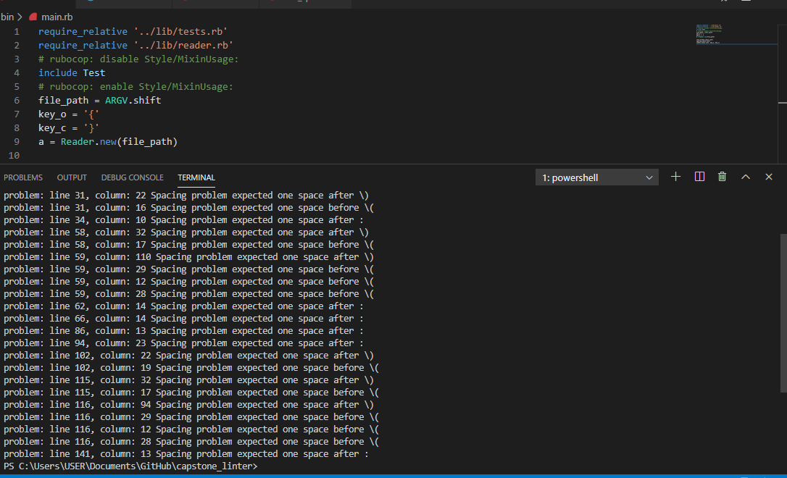
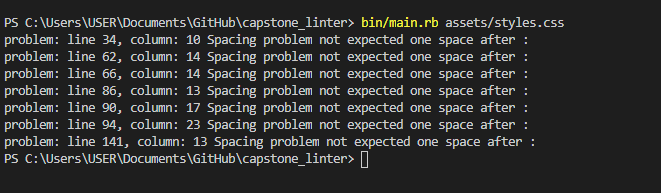

# CAPSTONE PROJECT MY OWN LINTER

This is a linter for begginers that use ruby to check a file *.css that could have problems with the indentation or the spaces and the break lines.

# What it does

takes a file *.css like a linter to check the common mistakes with the indentation or the line_form and it can discribe the spacing betewen the lines.

# HOW TO RUN IT

1) you have to clone or download the project. 
2) copy the specific path of the css file it looks like this.(C:\Users\USER\Documents\GitHub\capstone_linter\spec\spec\indent_test.css)
or
(home/html_project/assets/styles.css)
3) and then execute the file like this.

"ruby ../bin/main.rb (copy the css path here)" it looks like this 

4) correct the problems.
5) give the original repository a star on github :).

## Built With

- Ruby

#### and deployed to GitHub

## Live Demo

[Live Demo](https://repl.it/github/abcussi/capstone_linter)(not able until merge)

## Author

**Ángel Cussi**
- Github: [@profile](https://github.com/abcussi)
- Twitter: [@profile](https://twitter.com/thecussi)
- Linkedin: [profile](https://www.linkedin.com/in/angel-cussi-1b2310174/)

## 🤝 Contributing

This is a project for educational purposes only. We are not accepting contributions.

## Attributions and Credit

Special thanks to Microverse, for this learning opportunity. 

## Show your support

Give a ⭐️ if you like this project!

## Enjoy!
